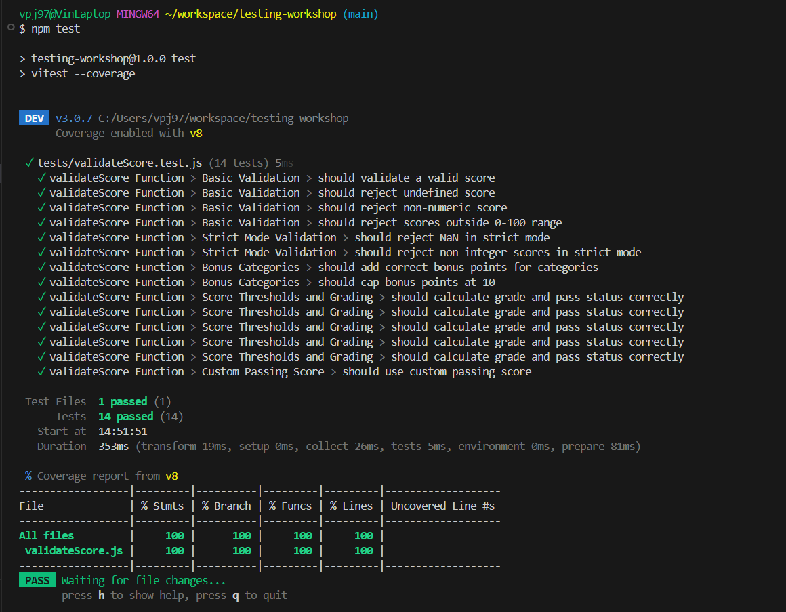
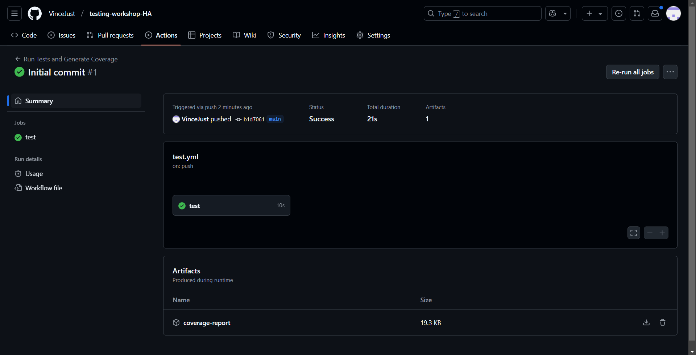
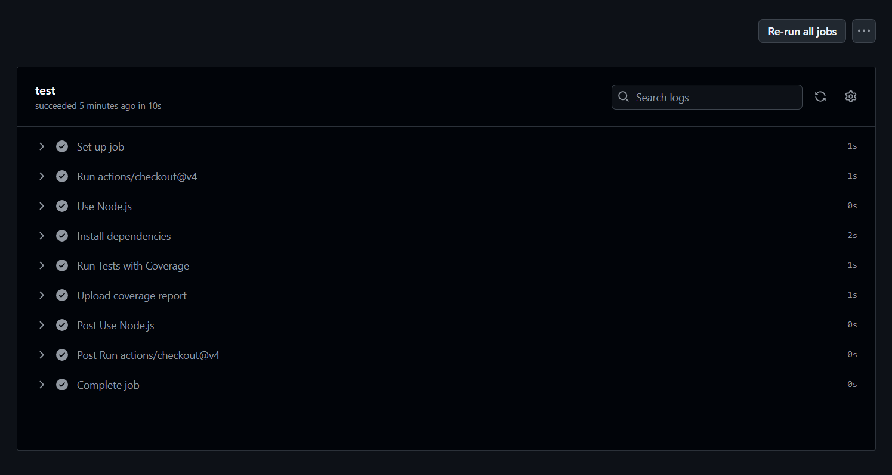

Testing Documentation für validateScore
Test-Coverage Report

Entdeckte Edge-Cases und Herausforderungen
1. Undefined Score Handling

Edge-Case: Übergabe eines undefined Scores
Herausforderung: Sicherstellen, dass die Funktion korrekt reagiert
Test-Strategie: Explizite Validierung und Fehlermeldung

2. Strenge Validierung mit strictMode

Edge-Case: Nicht-ganzzahlige Scores bei aktiviertem strictMode
Herausforderung: Zusätzliche Überprüfungen im strikten Modus
Test-Strategie: Unterschiedliche Validierungsregeln basierend auf Konfiguration

3. Bonus-Punkte Berechnung

Edge-Case: Korrekte Berechnung und Begrenzung von Bonus-Punkten
Herausforderung: Maximale Bonus-Punkte von 10 nicht überschreiten
Test-Strategie: Parametrisierte Tests für verschiedene Bonus-Kategorien

Test-Struktur
Die Tests sind in Describe-Blöcke organisiert:

Basic Validation
Strict Mode Validation
Bonus Categories
Score Thresholds and Grading
Custom Passing Score

Jeder Block testet spezifische Aspekte der validateScore-Funktion und deckt verschiedene Szenarien ab.
Test-Driven Development (TDD) Reflexion
Vorteile

Frühzeitige Fehlererkennung
Verbesserte Code-Qualität
Klare Anforderungsdefinition
Erleichterte Refactoring-Prozesse

Nachteile

Initialer Zeitaufwand höher
Kann überdetaillierte Tests produzieren
Erfordert Disziplin und Erfahrung

GitHub Action Status

